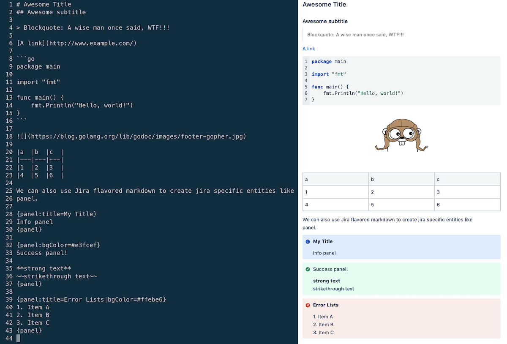

<div align="center">
    <a href="#">
        
    </a>
    <h1 align="center">JiraCLI</h1>
</div>

<div>
    <p align="center">
        <a href="https://github.com/ankitpokhrel/jira-cli/actions?query=workflow%3Abuild+branch%3Amaster">
            
        </a>
        <a href="https://goreportcard.com/report/github.com/ankitpokhrel/jira-cli">
            
        </a>
        <a href="https://github.com/ankitpokhrel/jira-cli/blob/master/LICENSE">
            
        </a>
        <a href="https://opencollective.com/jira-cli#backers">
            
        </a>
    </p>
    <p align="center">
        <i>Feature-rich Interactive Jira Command Line</i>
    </p>
    <br/><br/>
    <p align="center">
         <sub>
            Financial support from private and corporate sponsors ensures the tool's continued development.<br/>
            Please <a href="https://opencollective.com/jira-cli#backers">consider sponsoring the project</a> if you or your company rely on JiraCLI.
         </sub><br/><br/>
        <a href="https://opencollective.com/jira-cli#backers" target="_blank">
            
        </a>
    </p>
</div>

JiraCLI is an interactive command line tool for Atlassian Jira that will help you avoid Jira UI to some extent. This
tool may not be able to do everything, but it has all the essential features required to improve your day-to-day workflow with Jira.

The tool started with the idea of making issue search and navigation as straightforward as possible. However, with the
help of [outstanding supporters like you](#support-the-project), we evolved, and the tool now includes all necessary
features like issue creation, cloning, linking, ticket transition, and much more.

> This tool is heavily inspired by the [GitHub CLI](https://github.com/cli/cli)

## Supported platforms
Note that some features might work slightly differently in cloud installation versus on-premise installation due to the
nature of the data. Yet, we've attempted to make the experience as similar as possible.

| Platform | <a href="#"></a><a href="#"></a><a href="#"></a><a href="#"></a><a href="#"></a> |
| :------------- | :----------: |
| **Jira**  | <a href="#"></a><a href="#"></a> |

## Installation
`jira-cli` is available as a downloadable packaged binary for Linux, macOS, and Windows from the [releases page](https://github.com/ankitpokhrel/jira-cli/releases).

You can use Docker to quickly try out `jira-cli`.

```sh
docker run -it --rm ghcr.io/ankitpokhrel/jira-cli:latest
```

Follow the [installation guide](https://github.com/ankitpokhrel/jira-cli/wiki/Installation) for other installation methods like `Homebrew`, `Nix`, etc.

## Getting started

#### Cloud server

1. [Get a Jira API token](https://id.atlassian.com/manage-profile/security/api-tokens) and export it to your shell as
   a `JIRA_API_TOKEN` variable. Add it to your shell configuration file, for instance, `$HOME/.bashrc`, so that the
   variable is always available. Alternatively, you can also use `.netrc` file or `keychain` to set the token. Learn
   more [here](https://github.com/ankitpokhrel/jira-cli/discussions/356).
2. Run `jira init`, select installation type as `Cloud`, and provide required details to generate a config file required
   for the tool.

#### On-premise installation

1. Export required environment variables:
   - If you are using basic auth, export the `password` you use to login to Jira as a `JIRA_API_TOKEN` variable.
   - If you are using personal access token (PAT), get the `token` from your jira profile and export it as
     a `JIRA_API_TOKEN` variable. In addition to this, set `JIRA_AUTH_TYPE` env to `bearer`.
   - Add these ENVs to your shell configuration file, for instance, `$HOME/.bashrc`, so that they are always available.
   - Alternatively, you can also use `.netrc` file or `keychain` to set the token. Learn
     more [here](https://github.com/ankitpokhrel/jira-cli/discussions/356).
2. Run `jira init`, select installation type as `Local`, and provide the required details to generate a config file required
   for the tool.

   **Note:** If your on-premise Jira installation is using a language other than `English`, then the issue/epic creation
   may not work because the older version of Jira API doesn't return the untranslated name for `issuetypes`. In that case,
   you will have to fill in `epic.name`, `epic.link` and `issue.types.*.handle` fields manually in the generated config
   to get the expected behavior.

See [FAQs](https://github.com/ankitpokhrel/jira-cli/discussions/categories/faqs) for frequently asked questions.

#### Authentication types

The tool supports `basic` and `bearer` (Personal Access Token) authentication types at the moment. Basic auth is used by
default. If you want to use PAT, you need to set `JIRA_AUTH_TYPE` as `bearer`.

#### Shell completion
Check `jira completion --help` for more info on setting up a bash/zsh shell completion.

## Usage
The tool currently comes with an issue, epic, and sprint explorer. The flags are [POSIX-compliant](https://www.gnu.org/software/libc/manual/html_node/Argument-Syntax.html).
You can combine available flags in any order to create a unique query. For example, the command below will give you high priority issues created this month
with status `To Do` that are assigned to you and has the label `backend`.
```sh
jira issue list -yHigh -s"To Do" --created month -lbackend -a$(jira me)
```

### Navigation
The lists are displayed in an interactive UI by default.
- Use arrow keys or `j, k, h, l` characters to navigate through the list.
- Use `g` and `G` to quickly navigate to the top and bottom respectively.
- Use `CTRL + f` to scroll through a page downwards direction.
- Use `CTRL + b` to scroll through a page in upwards direction.
- Press `v` to view selected issue details.
- Press `m` to transition the selected issue.
- Press `CTRL + r` or `F5` to refresh the issues list.
- Hit `ENTER` to open the selected issue in the browser.
- Press `c` to copy issue URL to the system clipboard. This requires `xclip` / `xsel` in linux.
- Press `CTRL + k` to copy issue key to the system clipboard.
- In an explorer view, press `w` or `TAB` to toggle focus between the sidebar and the contents screen.
- Press `q` / `ESC` / `CTRL + c` to quit.
- Press `?` to open the help window.

### Resources
- [FAQs](https://github.com/ankitpokhrel/jira-cli/discussions/categories/faqs)
- [Introduction and Motivation](https://medium.com/@ankitpokhrel/introducing-jira-cli-the-missing-command-line-tool-for-atlassian-jira-fe44982cc1de)
- [Getting Started with JiraCLI](https://www.mslinn.com/blog/2022/08/12/jiracli.html)

## Commands
### Issue
Issues are displayed in an interactive table view by default. You can output the results in a plain view using the `--plain` flag.

#### List
The `list` command lets you search and navigate the issues. The issues are sorted by `created` field in descending order by default.

```sh
# List recent issues
$ jira issue list

# List issues created in last 7 days
$ jira issue list --created -7d

# List issues in status "To Do"
$ jira issue list -s"To Do"

# List recent issues in plain mode
$ jira issue list --plain

# List issue in the same order as you see in the UI
$ jira issue list --order-by rank --reverse

# You can execute raw JQL within a given project context using `--jql/-q` option.
# For instance, the following command will list issues in the current project whose
# summary has a word cli.
$ jira issue list -q "summary ~ cli"
```

Check some more examples/use-cases below.

<details><summary>List issues that I am watching</summary>

```sh
jira issue list -w
```
</details>

<details><summary>List issues assigned to me</summary>

```sh
jira issue list -a$(jira me)
```
</details>

<details><summary>List issues assigned to a user and are reported by another user</summary>

```sh
jira issue list -a"User A" -r"User B"
```
</details>

<details><summary>List issues assigned to me, is of high priority and is open</summary>

```sh
jira issue list -a$(jira me) -yHigh -sopen
```
</details>

<details><summary>List issues assigned to no one and are created this week</summary>

```sh
jira issue list -ax --created week
```
</details>

<details><summary>List issues with resolution won't do</summary>

```sh
jira issue list -R"Won't do"
```
</details>

<details><summary>List issues whose status is not done and is created before 6 months and is assigned to someone</summary>

```sh
# Tilde (~) acts as a not operator
jira issue list -s~Done --created-before -24w -a~x
```
</details>

<details><summary>List issues created within an hour and updated in the last 30 minutes :stopwatch:</summary>

```sh
jira issue list --created -1h --updated -30m
```
</details>

<details><summary>Give me issues that are of high priority, are in progress, were created this month, and have given labels :fire:</summary>

```sh
jira issue list -yHigh -s"In Progress" --created month -lbackend -l"high-prio"
```
</details>

<details><summary>Wait, what was that ticket I opened earlier today? :tired_face:</summary>

 ```sh
 jira issue list --history
 ```
</details>

<details><summary>What was the first issue I ever reported on the current board? :thinking:</summary>

```sh
jira issue list -r$(jira me) --reverse
```
</details>

<details><summary>What was the first bug I ever fixed in the current board? :beetle:</summary>

```sh
jira issue list -a$(jira me) -tBug sDone -rFixed --reverse
```
</details>

<details><summary>What issues did I report this week? :man_shrugging:</summary>

```sh
jira issue list -r$(jira me) --created week
```
</details>

<details><summary>Am I watching any tickets in project XYZ? :monocle_face:</summary>

```sh
jira issue list -w -pXYZ
```
</details>

#### Create
The `create` command lets you create an issue.

```sh
# Create an issue using an interactive prompt
$ jira issue create

# Pass required parameters and use --no-input option to skip prompt
$ jira issue create -tBug -s"New Bug" -yHigh -lbug -lurgent -b"Bug description" --fix-version v2.0 --no-input
```

To attach epic to an issue on creation, you can use `-P/--parent` field. We call it parent because the semantics of epic
has been changed in `next-gen` project.

```sh
# Create an issue of type Story and attach it to epic with key EPIC-42
$  jira issue create -tStory -s"Epic during creation" -PEPIC-42
```


You can use a `--custom` flag to set custom fields while creating the issue. See [this post](https://github.com/ankitpokhrel/jira-cli/discussions/346) for more details.

The command supports both [Github-flavored](https://github.github.com/gfm/)
and [Jira-flavored](https://jira.atlassian.com/secure/WikiRendererHelpAction.jspa?section=all) markdown for writing
description. You can load pre-defined templates using `--template` flag.

```sh
# Load description from template file
$ jira issue create --template /path/to/template.tmpl

# Get description from standard input
$ jira issue create --template -

# Or, use pipe to read input directly from standard input
$ echo "Description from stdin" | jira issue create -s"Summary" -tTask
```


> The preview above shows markdown template passed in Jira CLI and how it is rendered in the Jira UI.

#### Edit
The `edit` command lets you edit an issue.

```sh
$ jira issue edit ISSUE-1

# Edit issue in the configured project
$ jira issue edit ISSUE-1 -s"New Bug" -yHigh -lbug -lurgent -CBackend -b"Bug description"

# Use --no-input option to disable interactive prompt
$ jira issue edit ISSUE-1 -s"New updated summary" --no-input

# Use minus (-) to remove label, component or fixVersion
# For instance, to edit issue to 
#   - remove label p2, component FE, fixVersion v1.0 
#   - add label p1, component BE, fixVersion v2.0
$ jira issue edit ISSUE-1 --label -p2 --label p1 --component -FE --component BE --fix-version -v1.0 --fix-version v2.0
```

#### Assign
The `assign` command lets you assign a user to an issue.

```sh
# Assign user to an issue using an interactive prompt
$ jira issue assign

# Pass required parameters to skip prompt
$ jira issue assign ISSUE-1 "Jon Doe"

# Assign to self
$ jira issue assign ISSUE-1 $(jira me)

# Will prompt for selection if keyword suffix returns multiple entries
$ jira issue assign ISSUE-1 suffix

# Assign to default assignee
$ jira issue assign ISSUE-1 default

# Unassign
$ jira issue assign ISSUE-1 x
```


#### Move/Transition
The `move` command lets you transition an issue from one state to another.

```sh
# Move an issue using an interactive prompt
$ jira issue move

# Pass required parameters to skip prompt
$ jira issue move ISSUE-1 "In Progress"
```


If your workflow allows to add comment, resolution or assignee while moving an issue, you can do so as shown below.
See [this documentation](https://confluence.atlassian.com/jirakb/how-to-add-a-comment-during-a-transition-779160682.html) on how to setup your workflow to allow these fields.

```sh
# Move an issue and add comment
$ jira issue move ISSUE-1 "In Progress" --comment "Started working on it"

# Set resolution to fixed and assign to self while moving the issue
$ jira issue move ISSUE-1 Done -RFixed -a$(jira me)
```

To transition the selected issue from the TUI, press `m`.

#### View
The `view` command lets you see issue details in a terminal. Atlassian document is roughly converted to a markdown
and is nicely displayed in the terminal.

The command uses `less` as a pager by default. To set your own pager, see https://github.com/ankitpokhrel/jira-cli/discussions/569.

```sh
$ jira issue view ISSUE-1
```


The view screen will display linked issues and the latest comment after the description. Note that the displayed comment may
not be the latest one if you for some reason have more than 5k comments in a ticket.

```sh
# Show 5 recent comments when viewing the issue
$ jira issue view ISSUE-1 --comments 5
```

#### Link
The `link` command lets you link two issues.

```sh
# Link an issue using an interactive prompt
$ jira issue link

# Pass required parameters to skip prompt
$ jira issue link ISSUE-1 ISSUE-2 Blocks
```

##### Remote
The `remote` command lets you add a remote web link to an issue.

```sh
# Adds a remote web link using an interactive prompt
$ jira issue link remote

# Pass required parameters to skip prompt
$ jira issue link remote ISSUE-1 https://example.com "Example text"
```

#### Unlink
The `unlink` command lets you unlink two linked issues.

```sh
# Unlink issues using interactive prompt
$ jira issue unlink

# Pass required parameters to skip prompt
$ jira issue unlink ISSUE-1 ISSUE-2
```

#### Clone
The `clone` command lets you clone an issue. You can update fields like summary, priority, assignee, labels, and
components when cloning the issue. The command also allows you to replace a part of the string (case-sensitive)
in summary and description using `--replace/-H` option.

```sh
# Clone an issue
$ jira issue clone ISSUE-1

# Clone issue and modify the summary, priority and assignee
$ jira issue clone ISSUE-1 -s"Modified summary" -yHigh -a$(jira me)

# Clone issue and replace text from summary and description
$ jira issue clone ISSUE-1 -H"find me:replace with me"
```

#### Delete
The `delete` command lets you delete an issue.

```sh
# Delete an issue using an interactive prompt
$ jira issue delete

# Pass required parameters to skip prompt
$ jira issue delete ISSUE-1

# Delete task along with all of its subtasks
$ jira issue delete ISSUE-1 --cascade
```

#### Comment
The `comment` command provides a list of sub-commands to manage issue comments.

##### Add
The `add` command lets you add a comment to an issue. The command supports both [Github-flavored](https://github.github.com/gfm/)
and [Jira-flavored](https://jira.atlassian.com/secure/WikiRendererHelpAction.jspa?section=all) markdown for writing
comment. You can load pre-defined templates using `--template` flag.

```sh
# Add a comment using an interactive prompt
$ jira issue comment add

# Pass required parameters to skip prompt
$ jira issue comment add ISSUE-1 "My comment body"

# Load comment from template file
$ jira issue comment add ISSUE-1 --template /path/to/template.tmpl

# Get comment from standard input
$ jira issue comment add ISSUE-1 --template -

# Or, use pipe to read input directly from standard input
$ echo "Comment from stdin" | jira issue comment add ISSUE-1
```

Note: For the comment body, the positional argument always takes precedence over the `--template` flag if both of them are passed. In the
example below, the body will be picked from positional argument instead of the template.
```sh
jira issue comment add ISSUE-42 "comment body positional" --template - <<'EOF'
comment body template
EOF
```

#### Worklog
The `worklog` command provides a list of sub-commands to manage issue worklog (timelog).

##### Add
The `add` command lets you add a worklog to an issue. The command supports markdown for worklog comments.

```sh
# Add a worklog using an interactive prompt
$ jira issue worklog add

# Pass required parameters and use --no-input to skip prompt
$ jira issue worklog add ISSUE-1 "2d 3h 30m" --no-input

# You can add a comment using --comment flag when adding a worklog
$ jira issue worklog add ISSUE-1 "10m" --comment "This is a comment" --no-input
```

### Epic
Epics are displayed in an explorer view by default. You can output the results in a table view using the `--table` flag.
When viewing epic issues, you can use all filters available for the issue command.

See [usage](#navigation) to learn more about UI interaction.

#### List
You can use all flags supported by `issue list` command here except for the issue type.

```sh
# List epics
$ jira epic list

# List epics in a table view
$ jira epic list --table

# List epics reported by me and are open
$ jira epic list -r$(jira me) -sOpen

# List issues in an epic
$ jira epic list KEY-1

# List all issue in an epic KEY-1 that is unassigned and has a high priority
$ jira epic list KEY-1 -ax -yHigh

# List high priority epics
$ jira epic list KEY-1 -yHigh

# List epic issues order by the rank in ASC order
$ jira epic list KEY-1 --order-by rank --reverse
```

#### Create
Creating an epic is the same as creating the issue except you also need to provide an epic name.

```sh
# Create an issue using an interactive prompt
$ jira epic create

# Pass required parameters to skip prompt or use --no-input flag to skip prompt for non-mandatory params
$ jira epic create -n"Epic epic" -s"Everything" -yHigh -lbug -lurgent -b"Epic description"
```

#### Add
The `add` command allows you to add issues to the epic. You can add up to 50 issues to the epic at once.

```sh
# Add issues to the epic using an interactive prompt
$ jira epic add

# Pass required parameters to skip prompt
$ jira epic add EPIC-KEY ISSUE-1 ISSUE-2
```

#### Remove
The `remove` command allows you to remove issues from the epic. You can remove up to 50 issues from the epic at once.

```sh
# Remove issues to the epic using an interactive prompt
$ jira epic remove

# Pass required parameters to skip prompt
$ jira epic remove ISSUE-1 ISSUE-2
```

### Sprint
Sprints are displayed in an explorer view by default. You can output the results in a table view using the `--table` flag.
When viewing sprint issues, you can use all filters available for the issue command. The tool only shows 25 recent sprints.

See [usage](#navigation) to learn more about UI interaction.

#### List
You can use all flags supported by `issue list` command to filter issues in the sprint.

```sh
# List sprints in an explorer view
$ jira sprint list

# List sprints in a table view
$ jira sprint list --table

# List issues in the current active sprint
$ jira sprint list --current

# List issues in the current active sprint that are assigned to me
$ jira sprint list --current -a$(jira me)

# List issues in the previous sprint
$ jira sprint list --prev

# List issues in next planned sprint
$ jira sprint list --next

# List future and active sprints
$ jira sprint list --state future,active

# List issues in a particular sprint. You can use all flags supported by issue list command here.
# To get sprint id use `jira sprint list` or `jira sprint list --table`
$ jira sprint list SPRINT_ID

# List high priority issues in a sprint are assigned to me
$ jira sprint list SPRINT_ID -yHigh -a$(jira me)

# List sprint issues order by the rank in ASC order
$ jira sprint list SPRINT_ID --order-by rank --reverse
```

#### Add
The `add` command allows you to add issues to the sprint. You can add up to 50 issues to the sprint at once.

```sh
# Add issues to the sprint using interactive prompt
$ jira sprint add

# Pass required parameters to skip prompt
$ jira sprint add SPRINT_ID ISSUE-1 ISSUE-2
```

### Other commands

<details><summary>Navigate to the project</summary>

```sh
jira open
```
</details>

<details><summary>Navigate to the issue</summary>

```sh
jira open KEY-1
```
</details>

<details><summary>List all projects you have access to</summary>

```sh
jira project list
```
</details>

<details><summary>List all boards in a project</summary>

```sh
jira board list
```
</details>

## Scripts
Often times, you may want to use the output of the command to do something cool. However, the default interactive UI might not allow you to do that.
The tool comes with the `--plain` flag that displays results in a simple layout that can then be manipulated from the shell script.

Some example scripts are listed below.

<details><summary>Tickets created per day this month</summary>

```bash
#!/usr/bin/env bash

tickets=$(jira issue list --created month --plain --columns created --no-headers | awk '{print $2}' | awk -F'-' '{print $3}' | sort -n | uniq -c)

echo "${tickets}" | while IFS=$'\t' read -r line; do
  day=$(echo "${line}" | awk '{print $2}')
  count=$(echo "${line}" | awk '{print $1}')

  printf "Day #%s: %s\n" "${day}" "${count}"
done

# Output
Day #01: 19
Day #02: 10
Day #03: 21
...
```
</details>

<details><summary>Number of tickets per sprint</summary>

```bash
#!/usr/bin/env bash

sprints=$(jira sprint list --table --plain --columns id,name --no-headers)

echo "${sprints}" | while IFS=$'\t' read -r id name; do
  count=$(jira sprint list "${id}" --plain --no-headers 2>/dev/null | wc -l)

  printf "%10s: %3d\n" "${name}" $((count))
done

# Output
Sprint 3:   55
Sprint 2:   40
Sprint 1:   30
...
```
</details>

<details><summary>Number of unique assignee per sprint</summary>

```bash
#!/usr/bin/env bash

sprints=$(jira sprint list --table --plain --columns id,name --no-headers)

echo "${sprints}" | while IFS=$'\t' read -r id name; do
  count=$(jira sprint list "${id}" --plain --columns assignee --no-headers 2>/dev/null | awk '{print $2}' | awk NF | sort -n | uniq | wc -l)

  printf "%10s: %3d\n" "${name}" $((count))
done

# Output
Sprint 3:   5
Sprint 2:   4
Sprint 1:   3
```
</details>

## Known Issues

1. Not all [Atlassian nodes](https://developer.atlassian.com/cloud/jira/platform/apis/document/structure/#nodes) are
   translated properly at the moment which can cause formatting issues sometimes.

## Feature requests

Please [open a discussion](https://github.com/ankitpokhrel/jira-cli/discussions/categories/ideas) in `ideas` category for the proposed feature.

##### How these requests are usually prioritized?

- The feature that is straightforward to implement, doesn't require too much mental power, and can be done even I am lazy will be picked first.
- If the feature is something that I am missing in my day-to-day work, it might be done first.
- Rest of the features will be picked based on the [number of votes](https://github.com/ankitpokhrel/jira-cli/discussions/categories/ideas) on the particular feature.

## Development
1. Clone the repo.
   ```sh
   git clone git@github.com:ankitpokhrel/jira-cli.git
   ```

2. Optional: If you want to run a Jira instance locally, you can use the following make recipe.
   The trial license key can be generated from the "Licenses" section in the [atlassian admin](https://my.atlassian.com).
   ```sh
   make jira.server
   ```

3. Make changes, build the binary, and test your changes.
   ```sh
   make deps install
   ```

4. Run CI steps locally before submitting a PR.
   ```sh
   make ci
   ```

## Support the project
Your suggestions and feedbacks are highly appreciated. Please feel free
to [start a discussion](https://github.com/ankitpokhrel/jira-cli/discussions)
or [create an issue](https://github.com/ankitpokhrel/jira-cli/issues/new) to share your experience with the tool or to
discuss a feature/issue.

If you think this tool is useful, saves you a lot of work, and lets you sleep much better, then consider supporting the
project by any of the following means:

- [Star the repo](https://github.com/ankitpokhrel/jira-cli/stargazers).
- Spread the word by sharing the project on social media or with friends.
- [Report bugs](https://github.com/ankitpokhrel/jira-cli/issues/new/choose)
  or [propose solutions](https://github.com/ankitpokhrel/jira-cli/issues).
- [Donate a small amount](https://opencollective.com/jira-cli#backers).

<div>
   <br/>
   <p align="center">
      <sub>Made with 💚</sub>
   </p>
</div>
